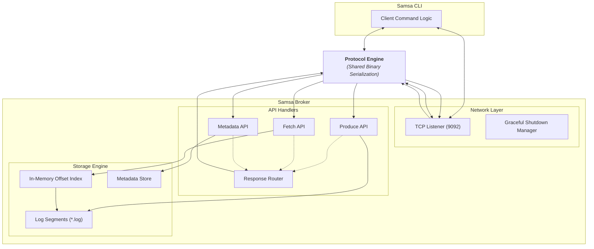

# Samsa

[](https://goreportcard.com/report/github.com/albertopastormr/samsa)
[](https://github.com/albertopastormr/samsa/actions)
[](https://opensource.org/licenses/MIT)

**Samsa** is a lightweight, Kafka-compatible message broker and CLI written in Go. It implements the core Kafka binary protocol, providing a high-performance distribution system for event-driven architectures.

## 🚀 Features

- **Single Binary Architecture**: The `samsa` CLI serves as both the broker (server) and the administrative tool (client).
- **Kafka Compatibility**: Implements core Kafka APIs including `Produce`, `Fetch`, `ApiVersions`, `CreateTopics`, and `DescribeTopicPartitions`.
- **Structured Logging**: Production-grade observability using `log/slog` with machine-readable JSON for servers and human-readable text for the CLI.
- **Disk Persistence**: High-throughput message logging with persistent storage on disk using the standard Kafka log segment format.
- **Real-time Consumption**: A built-in `consume` command that provides a `tail -f` experience for streaming messages.
- **Custom Protocol Engine**: A shared binary serialization engine used by both client and server for hand-crafted efficiency.
- **Graceful Shutdown**: Robust lifecycle management ensures zero data corruption during server restarts by flushing active writes and completing inflight requests.

## 📦 (For users) Installation

**Download pre-compiled binaries:**
You can download the latest version of Samsa for Linux, macOS, or Windows from the [Releases page](https://github.com/albertopastormr/samsa/releases).


## 🛠️ (For developers) Quick Start

### 1. Build
Compile the project into a single executable using the provided `Makefile`:
```bash
make build
```
This creates the `samsa` binary in the `bin/` directory.

### 2. Check Version
Verify the build metadata:
```bash
./bin/samsa version
```

### 3. Start the Server
Run the broker on the default port (`9092`):
```bash
./bin/samsa server
```

### 4. Interacting with the Broker
Once the server is running, use the built-in client to manage topics and stream data:

**Create a Topic:**
```bash
./bin/samsa topic create --name orders --partitions 3
```

**Produce Messages:**
```bash
./bin/samsa produce --topic orders --message "Hello Samsa"
```

**Consume in Real-time (tail -f):**
```bash
./bin/samsa consume --topic orders
```

**Low-level Fetch:**
```bash
./bin/samsa fetch --topic orders --partition 0 --offset 0
```


## 🏗️ Architecture

Samsa follows a **Hexagonal (Clean) Architecture** to ensure maintainability and testability:

- **Network Layer**: Handles TCP connection lifecycles, concurrency, and graceful shutdown via `NotifyContext`.
- **Protocol Layer**: A dedicated engine for manual bit-flipping and parsing of Kafka's binary wire format.
- **Handlers**: Decoupled logic for processing Produce, Fetch, and Metadata requests, routed via a unified response controller.
- **Storage Layer**: Manages thread-safe metadata and high-performance append-only logging to disk, backed by an **In-Memory Offset Index** for rapid message lookups.

### System Flow Diagram



## 🧪 Development

Run the full test suite with race detection:
```bash
make test
```

Cleanup build artifacts and logs:
```bash
make clean
```

---
*Inspired by the Kafka protocol. Built for education and performance.*
